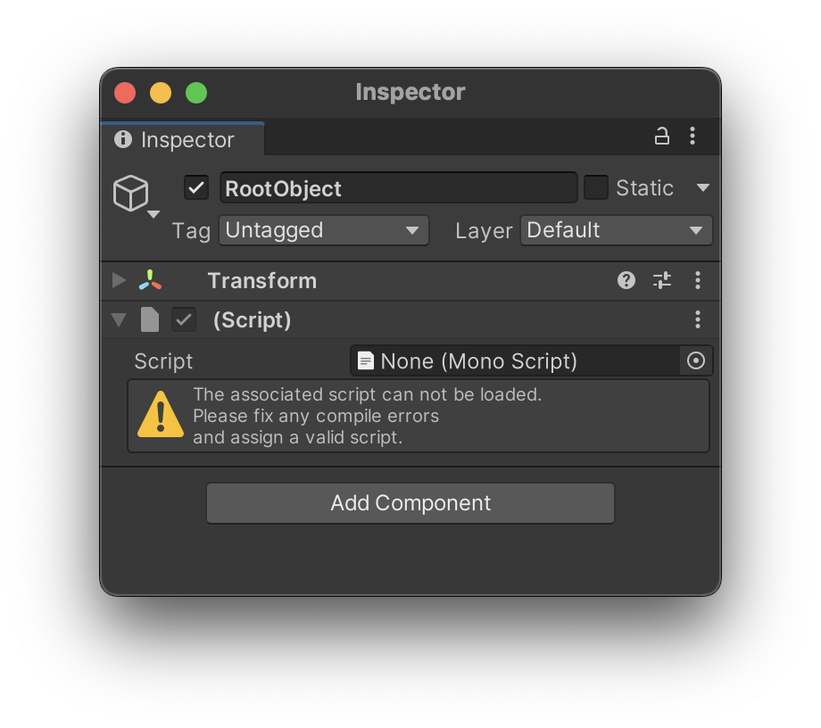
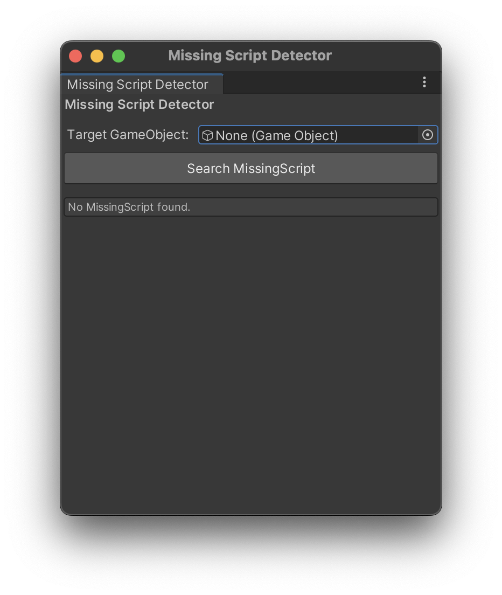
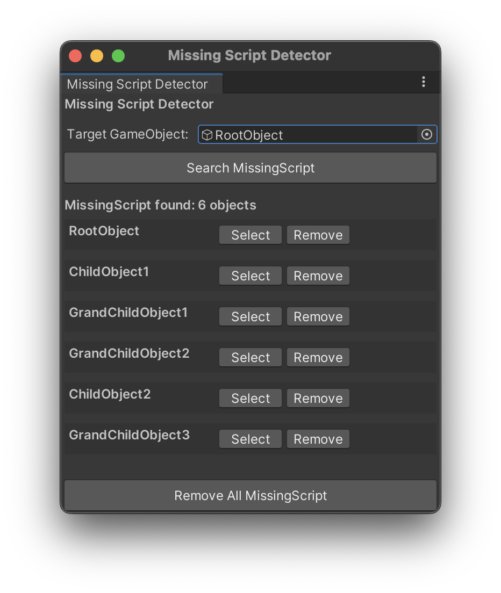

# Missing Script Detector

[](https://openupm.com/packages/com.segur.missing-script-detector/)
[](https://openupm.com/packages/com.segur.missing-script-detector/)


# About This Tool

A Unity Editor extension that selects GameObjects placed in the Hierarchy and lists all MissingScripts from all child GameObjects.

## What is MissingScript?

MissingScript is a problem that occurs when script files are deleted or moved. In the Inspector, it appears as `None (Mono Script)`, and finding and removing these manually is a very tedious task.



With this tool, you can easily detect MissingScripts and safely remove them.

## Main Features

- Detect all MissingScripts under a specified GameObject
- Display search results in a list
- Remove MissingScripts individually or in bulk
- Safe removal process (with confirmation dialog)

# Requirements

Unity 2022.3 or later

# Installation via OpenUPM CLI

```bash
# Install openupm-cli
npm install -g openupm-cli

# Navigate to your Unity project directory
cd YOUR_UNITY_PROJECT_DIR

# Install the package
openupm add com.segur.missing-script-detector
```

# How to Use

## 1. Open Missing Script Detector
Select `Tools > Missing Script Detector` from Unity's menu bar.

## 2. Access the Missing Script Detector Window

The Missing Script Detector window will appear.



## 3. Execute Search

1. Drag and drop a GameObject into the **Target GameObject** field, or click the circle button on the right to select
2. Click the **"Search MissingScript"** button
3. Results will be displayed in a list



## 4. Operate on Search Results

The following operations are available for search results:

- **Select**: Select the corresponding GameObject in Hierarchy and show its location
- **Remove**: Remove MissingScript individually (confirmation dialog will be displayed)
- **Remove All MissingScript**: Remove all detected MissingScripts in bulk

## 5. Confirm Removal

When the removal process is complete, MissingScripts are safely removed.

# Important Notes

- MissingScript removal cannot be undone
- A confirmation dialog will always be displayed before removal
- Removal process uses `GameObjectUtility.RemoveMonoBehavioursWithMissingScript()` for safe operation

# File Structure

```
com.segur.missing-script-detector/
├── Editor/
│   ├── MissingScriptDetector.cs          # Main EditorWindow class
│   ├── MissingScriptService.cs           # MissingScript search and removal service
│   └── Unity.MissingScriptDetector.Editor.asmdef
├── Tests/
│   ├── MissingScriptServiceTests.cs      # Test files
│   └── Unity.MissingScriptDetector.Tests.asmdef
├── package.json
└── README.md
```

# Technical Specifications

- Compatible with Unity 2022.3 or later
- Implemented as Editor extension
- Recursive GameObject search
- Safe removal using `GameObjectUtility.RemoveMonoBehavioursWithMissingScript()`
- Test-driven development (TDD) support

# License

MIT License
